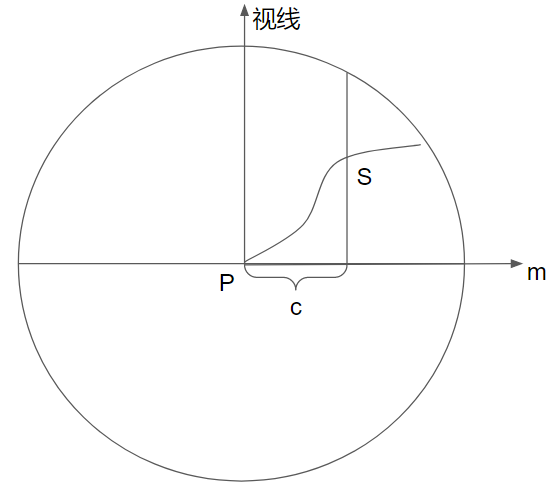

【NOTE】该文档已过时

# 一、出射光线的计算
假设物体表面都是Lambertian Surface，即满足

$$L_o(p,n,v)=\frac{\rho_{ss}}{\pi}E(p,n)$$(1)

其中，p为当前着色点的坐标，n为法线向量，v为视线向量，$\rho_{ss}$为次表面散射率，$E(p,n)$为当前着色点接收到的irradiance。

我们简单假设$\rho_{ss}=\pi$，这只是单纯地为了计算方便，则有

$$L_o(p,n,v)=E(p,n)=\int_{l\in\Omega}v(p,l)(n\cdot l)^+L(p,l)dl$$(2)

其中，$v(p,l)$为可见性函数，若光源可从$l$射向$p$点，则$v(p,l)=1$，否则为0。$L(p,l)$为光照函数，表示沿$l$射向$p$的光照强度。

# 二、辐射度(irradiance)的计算
计算HBAO即计算环境光照，假设环境光源于无穷远处且各方向的环境光照都相等，为一定值$L_A$，则

$$E(p,n)=L_A\int_{l\in\Omega}v(p,l)(n\cdot l)^+dl$$(3)

再设AO因子$k_A$：

$$k_A(p,n)=\frac{1}{\pi}\int_{l\in\Omega}v(p,l)(n\cdot l)^+dl$$(4)

则有

$$E(p,n)=\pi k_A(p,n)L_A$$(5)

# 三、AO因子($k_A$)的计算
假设可见性函数仅和遮挡有关，并只在一个半径为R的半球内计算可见性函数,并用一个衰减函数$W(p,l)$代替余弦项$(\vec n\cdot l)^+$，则

$$
\begin{aligned}
k_A(p,\vec n)
    &\approx \frac{1}{\pi}\int_{l\in\Omega}v(p,l)W(p,l)dl \\
    &\approx \frac{1}{\pi}
        \left(
            1-\frac{1}{2\pi}
            \int_{\theta=-\pi}^\pi \int_{\alpha=-\frac{\pi}{2}}^{\frac{\pi}{2}}(1-v(p,l))W(p,l)cos\alpha d\alpha d\theta
        \right)
\end{aligned}
$$(6)

其中，$cos\alpha$为$dl=cos\alpha d\alpha d\theta$时引入的。

## 1. $h(\theta)$与$t(\theta)$的计算

如上图，引入两个角度$t(\theta)$和$h(\theta)$。$t(\theta)$表示切平面（按图示的顺时针）旋转到视线平面所需的角度。$h(\theta)$表示在$\theta$指定的方向上，在切平面上，使$v(p,l)=1$的最小$\alpha$，即切平面上最开始没有遮挡的（关于视线平面的）角度。

这两个角度之间的范围描述了这个半圆内哪些空间有遮挡物，若假设P点周围是连续的深度场（即有遮挡物的角度范围是连续的），则式(6)可转化为

$$
\begin{aligned}
k_A(p,\vec n)
    &\approx \frac{1}{\pi}
        \left(
            1-\frac{1}{2\pi}
            \int_{\theta=-\pi}^\pi \int_{\alpha=t(\theta)}^{h(\theta)}W(p,l)cos\alpha d\alpha d\theta
        \right) \\
    &= \frac{1}{\pi}
        \left(
            1-\frac{1}{2\pi}
            \int_{\theta=-\pi}^\pi
            W(\theta)
            (sin(h(\theta))-sin(t(\theta)))
            d\theta
        \right) 
\end{aligned}
$$(6.5)

### a. $t(\theta)$的计算

为了计算$t(\theta)$，首先引入视线平面的切向量$\vec m(\theta)$。

建立视坐标系，z轴正向为视线方向，原点为着色点，x轴、y轴只要满足正交则任意。

则对任意方位角$\theta$，可设$\vec m(\theta)=(cos\theta, sin\theta, 0)$，满足$\vec m(\theta)\cdot \vec n = 0$（即为视线平面的切向量），且与方位角$\theta$表示的方位平行，且为单位向量。

引入$\vec m(\theta)$后，即可计算$t(\theta)$：

$$t(\theta)=arccos(\vec n \cdot \vec m)-\frac{\pi}{2}$$(7)

### b. $h(\theta)$的计算
设$S(P, c)$为从P点出发沿$\vec m$走$c$的距离后作平行于视线向量的直线，其与几何体的交点，如下图所示：

再设$\vec d(P,c)=S(P,c)-P$，$\phi(P,c)=arctan\left(\frac{-\vec d(P,c).z}{||\vec d(P,l).xy||}\right)$。$\phi(P,c)$即为$S(P,c)$与P点的连线关于视线平面所成的夹角，设其最大值为：

$$
    \phi_{max}=\max_{c\in(0,R]}\{\phi(P,c)\}
$$(8)

设$c_{max}=\min_{c\in(0,R]}\{\phi(P,c)=\phi_{max}\}$，即使得$\phi$最大的c中最小的那个c。

然后可计算$h(\theta)$：

$$h(\theta)=
\begin{cases}
    \phi_{max} &\text{if } \phi_{max}\geq t(\theta) \\
    t(\theta) &\text{else }
\end{cases}
$$(9)

## 2. $W(\theta)$的计算
$W(\theta)$为距离衰减函数，最高的遮挡点离着色点越远，其值就越小，定义为：

$$W(\theta)=\max\left\{0, 1-\frac{r(\theta)}{3R}\right\}$$(10)

其中$r(\theta)$为距离函数，定义为：

$$
r(\theta)=
\begin{cases}
    ||S(P,c_{max})-P|| &\text{if } \phi_{max}\geq t(\theta) \\
    R &\text{else }
\end{cases}
$$(11)

之所以$W(\theta)$中分母用$3R$，而不是$R$，是为了避免$k_A$过小。

# 四、$k_A$的积分计算
上一节中在式(6.5)中导出了$k_A$的计算式，并分小节介绍了其中的变量该如何计算。但积分式本身不存在解析解，所以需要使用蒙特卡洛方法进行数值计算。为了方便，在此复写一下$k_A$的计算式：

$$
k_A(p,\vec n)
    \approx \frac{1}{\pi}
    \left(
        1-\frac{1}{2\pi}
        \int_{\theta=-\pi}^\pi
        W(\theta)
        (sin(h(\theta))-sin(t(\theta)))
        d\theta
    \right) 
$$

在$[-\pi, \pi]$范围内取$N_d$个$\theta$，记为$\theta_1,\theta_2,...,\theta_{N_d}$，则上式积分可变为：

$$
\begin{aligned}
    &\int_{\theta=-\pi}^\pi
        W(\theta)
        (sin(h(\theta))-sin(t(\theta)))
        d\theta \\
    &= \frac{1}{N_d}
        \sum_{i=1}^{N_d}
        W(\theta_i)
        (sin(h(\theta_i))-sin(t(\theta_i)))
\end{aligned}
$$(12)

## 1. $t(\theta_i)$和$h(\theta_i)$的计算
$t(\theta_i)$的计算与式(7)一样，为方便，在此复写：

$$t(\theta_i)=arccos(\vec n \cdot \vec m(\theta_i))-\frac{\pi}{2}$$

$h(\theta_i)$的计算中需要进行无数个变量的大小比较以得到最大角度，为了能够进行数值计算，我们采样其中几个点。为了方便，在此复写式(8)和式(9)

$$
    \phi_{max}=\max_{c\in(0,R]}\{\phi(P,c)\}
$$

$$h(\theta)=
\begin{cases}
    \phi_{max} &\text{if } \phi_{max}\geq t(\theta) \\
    t(\theta) &\text{else }
\end{cases}
$$

在$(0,R]$范围内取$N_s$个$c$，记为$c_1, c_2,...,c_{N_s}$。将$\phi_{max}$的计算转换为在这$N_s$个值内求最大，即：

$$
    \phi_{max}=\max_{j=1,2,...,N_s}\{\phi(P,c_j)\}
$$(13)

而$h(\theta)$的计算式不变，依然为式(9)。

## 2. $W(\theta_i)$的计算
$W(\theta_i)$的计算与式(10)相同，为了方便，在此复写：

$$W(\theta_i)=\max\left\{0, 1-\frac{r(\theta_i)}{3R}\right\}$$